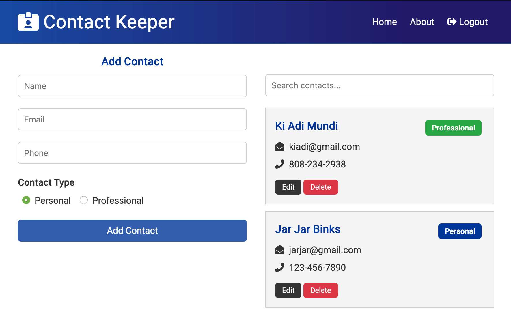
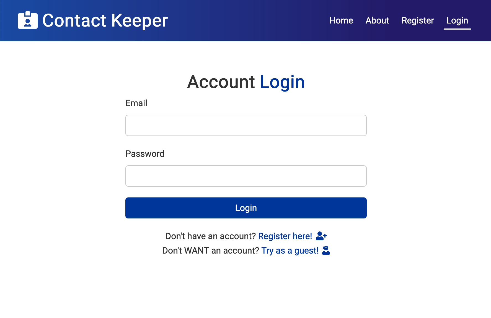
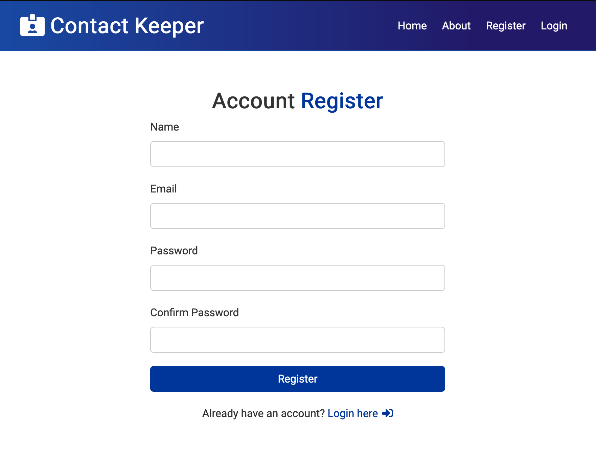

##Contact Keeper

Contact Keeper is a full stack web application for organizing and updating your contacts. The frontend was built with React, and the backend was built with Node/Express and MongoDB Atlas.  

The frontend uses React's Context API to manage and share data between components.

The application supports user registration and login, as well as a "Use as guest" feature for trying out the app without registering. 

You can find it deployed on Heroku at:  
https://contact-keeper-0.herokuapp.com/  

  

  

